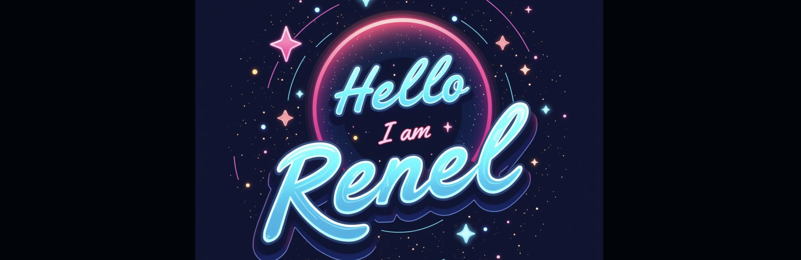

 
I'm a software engineering student in my last semester at Montreal Polytechnic, I am passionate about software development and machine learning. Some technologies I enjoy working with include Python, NextJs, Angular.

- 🔭 I’m currently working on a web-based chess game powered by artificial intelligence, building it from scratch as a personal project for fun
- 🌱 I’m currently learning c# and React Native for mobile app development

 

## Github stats:
|  |  |
| ------------- | ------------- |

## Find me: 
 <a href="https://www.linkedin.com/in/renel-lherisson-91b63849" target="_blank" >LinkedIn</a> | <a href="https://relhe.github.io" target="_blank">portfolio</a>
 
